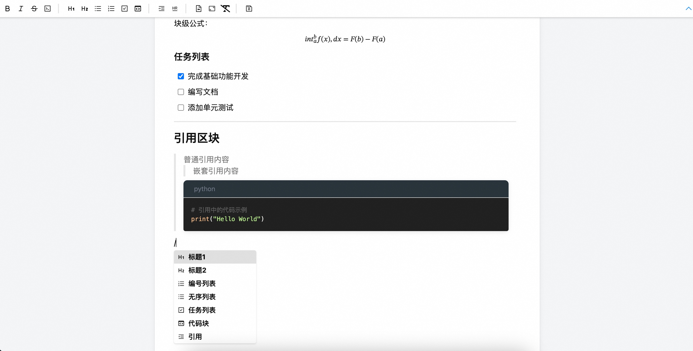

# Zenmark

✍️ Zenmark 是一个基于 Tiptap 的开源所见即所得 Markdown 编辑器，提供流畅的写作体验和丰富的功能。

[](LICENSE)

[English](./README.md) | 简体中文

## 🌐 在线演示

[在线 Demo](https://apps.eiooie.com/tiptap-editor/)



## ✨ 特性

- 🎯 **所见即所得**: 实时 Markdown 预览
- 📝 **智能编辑**: 键盘快捷键
- 🎨 **代码高亮**: 基于 highlight.js 的语法高亮
- 📊 **表格编辑**: 直观的表格编辑体验
- ✅ **任务列表**: 交互式任务列表
- 🔢 **数学公式**: 基于 KaTeX 的 LaTeX 数学公式支持
- 🌍 **国际化**: 多语言界面
- 🤝 **协作**: 基于 Yjs 的实时协作支持
- 🎨 **主题**: 支持亮色和暗色主题
- 🔌 **可扩展**: 基于 Tiptap 强大的扩展系统


## 🚀 快速开始

### 作为组件使用

```bash
npm install zenmark-editor
```

```jsx
import { ZenmarkEditor } from 'zenmark-editor';

function App() {
  return (
    <ZenmarkEditor
      readContent={() => Promise.resolve('# Hello Zenmark!')}
      writeContent={(content) => Promise.resolve()}
      subscribeContent={(cb) => () => {}}
    />
  );
}
```

## 📖 文档

### 属性

- `readContent`: () => Promise<string> - 读取初始内容的函数
- `writeContent`: (content: string) => Promise<void> - 处理内容更新的函数
- `subscribeContent`: (callback: (content: string) => void) => () => void - 订阅内容变更的函数

## 📄 许可证

[MIT License](LICENSE)
